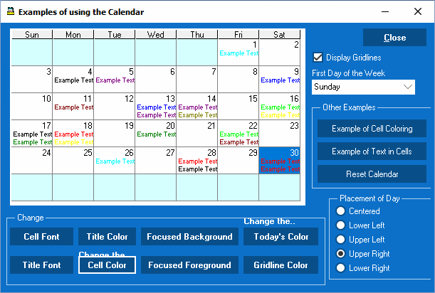
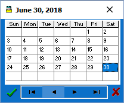
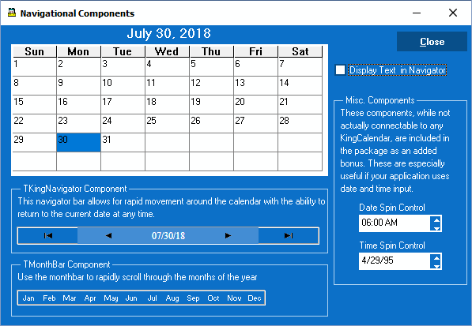
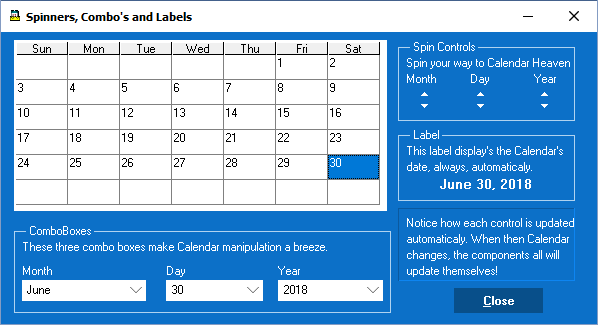
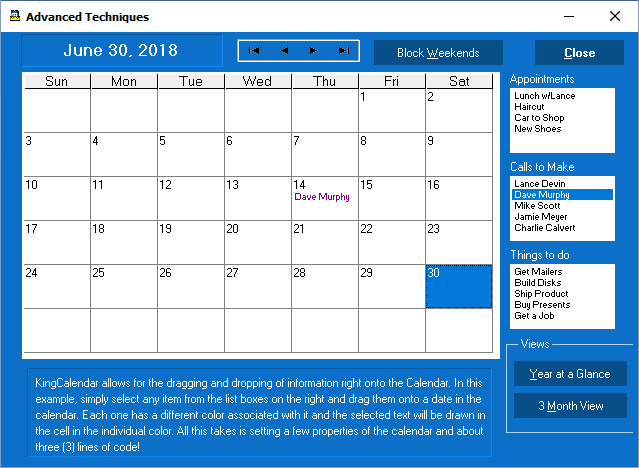

# KingCalendar for Delphi

A fully-featured VCL calendar component library for **Delphi 10.2 through 13**, supporting Win32, Win64, and Win64x platforms. Open source under the MIT License.

[](LICENSE)
[](https://www.embarcadero.com)
[](https://k7ler.github.io/KingCal/)

---

## Quick Install

Download and run the Windows installer — it detects every Delphi version on your machine, compiles the packages, and registers the components in each IDE automatically.

**[⬇ Download KingCalendarSetup.exe](https://github.com/K7LER/KingCal/raw/master/Installer/KingCalendarSetup.exe)**

> Close the Delphi IDE before running the installer. An `installation.log` is written to the install folder if you need to troubleshoot.

---

## Screenshots

| Main Calendar | Popup Picker | Navigation Controls |
|:---:|:---:|:---:|
|  |  |  |

| Spinner, Combo & Label Controls | Drag & Drop |
|:---:|:---:|
|  |  |

---

## Components

All controls install directly into the Delphi IDE component palette.

| Component | Description |
|---|---|
| `TKingCalendar` | Core month-grid calendar control |
| `TKingPopup` | Non-visual popup calendar |
| `TKingDateDialog` | Edit control with built-in calendar button |
| `TDBKingDlg` | Database-bound date picker (`TDataSource` / `TField`) |
| `TKingNavigator` | Panel with prev/next month & year buttons |
| `TMonthBar` | Row of 12 month-selection buttons |
| `TKingLabel` | Label that tracks the selected date |
| `TKingWeekLabel` | Label that displays the ISO week number |
| `TMonthSpin` / `TMonthCombo` | Spin and combo controls for month navigation |
| `TYearSpin` / `TYearCombo` | Spin and combo controls for year navigation |
| `TDaySpin` / `TDayCombo` | Spin and combo controls for day navigation |
| `TKingDateSpin` | Inline date spin editor |
| `TKingTimeSpin` | Inline time spin editor |
| `TKingHMSpin` | Hour/minute/second field-by-field spin editor |
| `TKingMDYSpin` | Month/day/year field-by-field spin editor |

---

## Delphi Version Support

| Delphi Version | BDS Key | Package Suffix | Win32 | Win64 | Win64x |
|---|---|---|:---:|:---:|:---:|
| Delphi 13 | 37.0 | `370` | ✓ | ✓ | ✓ |
| Delphi 12 | 29.0 | `360` | ✓ | ✓ | — |
| Delphi 11 | 22.0 | `290` | ✓ | ✓ | — |
| Delphi 10.4 | 21.0 | `280` | — | ✓ | — |
| Delphi 10.3 | 20.0 | `270` | — | ✓ | — |
| Delphi 10.2 | 19.0 | `260` | — | ✓ | — |

---

## Manual Installation (Git Clone)

Use this method if you want the full source and prefer to manage builds yourself.

```
git clone https://github.com/K7LER/KingCal.git
```

1. In Delphi go to **Tools → Options → Delphi Options → Library**.
2. Add `LIBD<ver>x64\RELEASE` (and `LIBD<ver>x32\RELEASE` for 32-bit targets) to the **Library Path**.
3. Add the `source\` folder to the **Browsing Path**.
4. Open the group project for your version, e.g. `packages\13\D13All.groupproj`.
5. Compile the runtime package (`KingCalendar370.dpk`) first.
6. Compile the design-time package (`dclKingCalendar370.dpk`).
7. Right-click the design-time package → **Install**.

See the [Wiki](https://github.com/K7LER/KingCal/wiki) for version-specific library folder names and detailed step-by-step instructions for each Delphi release.

---

## Demo Projects

Five ready-to-compile demo projects are included for Delphi 10.2, 10.3, 10.4, and 13 under the `Demos\` folder.

| Demo | Description |
|---|---|
| **Main Demo** | Full `TKingCalendar` feature tour — color sets, blocked days, events, annotations |
| **Drag & Drop** | Dragging selected dates between two calendars |
| **Navigation** | Wiring `TKingNavigator`, spin, and combo controls to a calendar |
| **Date Picker** | `TKingPopup` and `TKingDateDialog` in a real form |
| **Start Day** | Switching the first day of the week at runtime |

---

## Key Features

- **Full month-grid calendar** with day selection, blocked days, flagged days, and per-cell color customization
- **Nine built-in color sets** (`ColorSet1`–`ColorSet9`) configurable at design or runtime
- **High DPI and VCL Styles** compatible
- **Database binding** via `TDBKingDlg` linked to any `TDataSource` / `TField`
- **Color bar overlays** for visualizing multi-day events or ranges
- **No external dependencies** — pure Object Pascal, no third-party runtime required

---

## Documentation

- **[Project Website](https://k7ler.github.io/KingCal/)** — feature overview, screenshots, and install guide
- **[Wiki](https://github.com/K7LER/KingCal/wiki)** — full component reference, property/event/method listings, and code examples
- **`Documentation\kingcal30.rtf`** — original component reference guide (included in the install)

---

## Contributing

Bug reports and pull requests are welcome. Please open an issue first for anything beyond a small fix.

- [Open an issue](https://github.com/K7LER/KingCal/issues)
- [Read the contributing guide](CONTRIBUTING.md)

---

## Version History

| Version | Date | Notes |
|---|---|---|
| 26.1.1 | 2026-01-01 | Added Delphi 13 support; Windows installer |
| 2.1.1 | 2023-12-12 | Added Delphi 12 support |
| 2.0.9 | 2022-12-01 | Added Delphi 11 support |
| 2.0.8 | 2018-12-31 | VCL Styles navigator fix; Segoe UI default font; `TKingWeekLabel` added |
| 2.0.6 | 2018-12-30 | International locale date format support |
| 2.0.2 | 2018-12-29 | Added Delphi 10.3 Rio support |
| 2.0.0 | 2018-06-28 | Initial open-source release |

---

## License

MIT License. See [LICENSE](LICENSE) for the full text.

**Original component:** Mark Lussier and AppVision © 1995–2000
**Current maintainer:** Lance Rasmussen — [lancerasmussen@gmail.com](mailto:lancerasmussen@gmail.com)

In June 2018, Mark Lussier gave Lance Rasmussen permission to open-source KingCalendar and publish it on GitHub.
